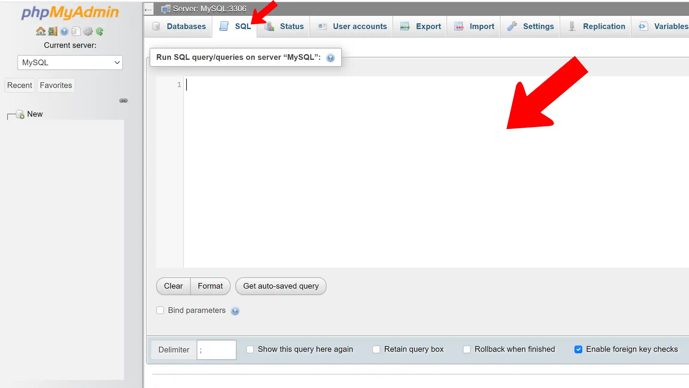
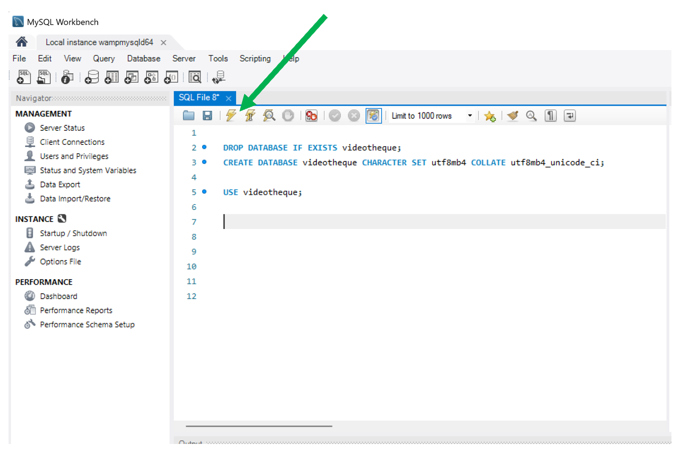
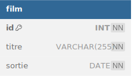

# Module 02 - Ma Première Base de données
<a href="../00 Les fichiers PDF - Supports de cours/02 Ma première Base de données.pdf">
  
</a>  
<br>
<a href="../00 Les fichiers PDF - Supports de cours/02 Ma première Base de données.pdf">
02 Ma première Base de données.pdf
</a>  
  
## Dans PhpMyAdmin ouvrez le terminal SQL
:one: Cliquez sur l'onglet SQL  
:two: Saisir le code SQL   
:three: Cliquez sur GO 
   
 

## OU dans Workbench ouvrez le terminal SQL
:one: Cliquez sur l'onglet SQL    
:two: Saisir le code SQL  
:three:  Cliquez sur l'éclaire

     


## Une documentation bien utile !
https://www.w3schools.com/mysql/default.asp  
https://sql.sh/  
https://dev.mysql.com/doc/refman/8.4/en/select.html  


## Création d'une base de données &#x1F600;
Commande pour créer une base de données
```sql
CREATE DATABASE ma_base;
```

Il est préférable de rajouter l'encodage **UTF8**:
```sql
CREATE DATABASE videotheque CHARACTER SET utf8mb4 COLLATE utf8mb4_unicode_ci;
```

SI je souhaite créer la base si elle n'existe pas 
<code>IF NOT EXISTS</code>
  
```mysql
CREATE DATABASE IF NOT EXISTS videotheque CHARACTER SET utf8mb4 COLLATE utf8mb4_unicode_ci;
```

Je precise la base que j'utilise pour la suite des commandes SQL  
avec <code>USE</code>
```mysql
USE videotheque;
```
## Effacer une base de données :warning:
:warning: Attention **toutes les tables** de la base seront effacées.  
:warning: Attention **toutes les données** à l'intérieur des tables seront effacées.
    
Il est possible d'effacer sa base :
```sql
DROP DATABASE ma_data_base;
```
Nous pouvons l'effacer **uniquement** si elle existe
```sql
DROP DATABASE IF EXISTS ma_data_base;
```

## Création de notre première table

Voici la commande pour créer une table :
```sql
CREATE TABLE film(...);
```
Il est recommandé  preciser le **moteur de stockage** de ma table  
InnoDB est un moteur de stockage : **storage engine**    
Sinon par défault j'aurais **MylSAM** au lien de innoDB    
Celà sera problématique pour les contraintes de clefs étrangère    

```sql
CREATE TABLE film (..) ENGINE=InnoDB; 
```
Je peux créer la table si elle n'existe pas
 <code>IF NOT EXISTS</code>:
 
```sql
CREATE TABLE IF NOT EXISTS film (..) ENGINE=InnoDB; 
```
## Effacer notre première table
Effacer une table :  
:warning: **Attention toutes les données seront éffacées !** :sweat_smile:
```sql
DROP TABLE film;
```
Effacer une table si elle existe:
```sql
DROP TABLE IF EXISTS film;
```


## Les type de champs : Data types
https://www.w3schools.com/mysql/mysql_datatypes.asp

Les principaux types de champs:

| Champs | Types | Valeurs |
|----|---|---|
| INT | entier | de -2 147 483 648 à **2 147 483 648**  |
| TINYINT(1)   | entier  | de -128 à 127 |
| VARCHAR(255)  | chaîne de caractères  | de 0 à 255 caractères  |
| TEXT | chaîne de caractères  | de 0 à 65 535 caractères  |
| DECIMAL(3,2) | réels | de -999.00 à 999.00 |


:watch: Les dates  :
| Champs | Informations |
|----|---|
| DATE | juste la date  |
| DATETIME | la date et l'heure |
| TIMESTAMP | la date et l'heure - nombres de secondes écoulées depuis le 1er janv 1970 |
| YEAR | juste l'année  |

Autres  :
| Champs | Informations |
|----|---|
| ENUM ('vert','rouge') | choix prédéfini  |

# Exemple : Création d'une table film

    
  
  
## :key: Mise en place d'une clé primaire sur notre table
La clef primaire : **primary key** ou **PK**  
    
Afin d'identifier une ligne de façon précise on définit une clef primaire    
La clef primaire peut être définit par MySQL **AI** ou **AUTO_INCREMENT**  
   
:lock: La contrainte de clef primaire impose d'avoir qu'un seul ID  
c'est à dire si je rentre le même ID  :MySQL me bloque 
(violation de clef de contrainte de clef primaire)  
Car je viole la contrainte de clef primaire  
  
Nous rajoutons aussi la **contrainte de nullité**    
Car notre id ne peut être null

```sql
CREATE TABLE film (
  id INT NOT NULL AUTO_INCREMENT PRIMARY KEY
);
```

**Bonne pratique**   :heart_eyes: :  
Il est aussi possible de définir la clef primaire à la fin :   
Avec <code>CONSTRAINT</code> je nomme la clef primaire <code>pk_film</code>    
**pk** pour **p**rimary **k**ey  + <code>le nom de la table</code>   
:warning: Dans ce cas là on enlève <code>PRIMARY KEY</code> de la premère ligne
```sql

CREATE TABLE film (
  id INT NOT NULL AUTO_INCREMENT,
  titre VARCHAR(255) NOT NULL,
  sortie DATE NOT NULL,
  CONSTRAINT pk_film PRIMARY KEY (id)
) ENGINE=InnoDB;
```


## :movie_camera: Création des autres champs :
:warning: Chaque ligne est terminée par une **virgule** <code>,</code>    
**sauf la dernière ligne**
```sql

CREATE TABLE film (
  id INT NOT NULL AUTO_INCREMENT PRIMARY KEY,
  titre VARCHAR(255) NOT NULL,
  sortie DATE NOT NULL
) ENGINE=InnoDB;
```


Je peux rajouter des commentaires avec <code>#</code> ou <code>--</code> ou <code>/* .... */</code>

```sql
-- je selectionne ma database : videotheque
USE videotheque ;
# creation table film;
/* ceci est aussi des commentaires */
CREATE TABLE film (
  id INT NOT NULL AUTO_INCREMENT,
  titre VARCHAR(255) NOT NULL,
  sortie DATE NOT NULL,
  CONSTRAINT pk_film PRIMARY KEY (id)
) ENGINE=InnoDB;
```
# Conclusion
```sql
# 1 - Effacer le base de données si elle existe
DROP DATABASE IF EXISTS videotheque;
# 2 - Créer la base de données
CREATE DATABASE videotheque CHARACTER SET utf8mb4 COLLATE utf8mb4_unicode_ci;
# 3 -Préciser la base de données sur laquelle je travaille
USE videotheque;
# 4 -Création de la table
CREATE TABLE film (
    id INT NOT NULL AUTO_INCREMENT,
    titre VARCHAR(255) NOT NULL,
    sortie DATE NOT NULL
    CONSTRAINT pk_film PRIMARY KEY(id)
) ENGINE=InnoDB; 
```