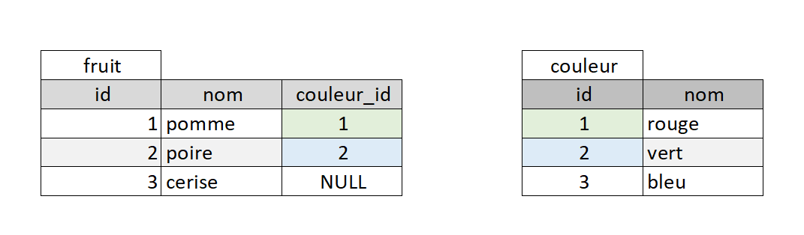

# Module 05 - Mise en place de la contrainte de clef etrangère

<a href="../00 Les fichiers PDF - Supports de cours/05 La clef étrangère.pdf">
  
</a>  
<br>
<a href="../00 Les fichiers PDF - Supports de cours/05 La clef étrangère.pdf">
05 La clef étrangère
</a> 

<br>
<br>
     
  

  
  



## Une clef étrangère ?
- C'est la clef primaire d'une autre table.
- Mise en place d'un **contrainte d'intégrité** de clef étragère:
  - je viens vérifier que l'id ajouter est bien un id de clef primaire existant.  
  - La clef étragère <code>couleur_id</code> de la table fruit doit correspondre à la clef primaire <code>id</code> de couleur  

# relation clef étrangère :
**Many to One** et **One To many**
Un fruit à une seule couleur : **Many to One**  
Une couleur est posséder par plusieurs fruis **One to   Many** 


## Création des tables Version 1 :
**Version 1** la clef étrangère est definit dans la table <code>fruit</code>

```sql
DROP DATABASE IF EXISTS salade_de_fruits;
CREATE DATABASE salade_de_fruits CHARACTER SET utf8mb4 COLLATE utf8mb4_unicode_ci;
USE salade_de_fruits;
# -------------------

CREATE TABLE couleur (
  id INT NOT NULL AUTO_INCREMENT,
  nom VARCHAR(30) NOT NULL,
  CONSTRAINT pk_couleur PRIMARY KEY(id)
)ENGINE=InnoDB;


-- ajout de la contrainte de clef etrangere foreign key dans la table fruit
CREATE TABLE fruit (
  id INT NOT NULL AUTO_INCREMENT,
  nom VARCHAR(30) NOT NULL,
  couleur_id INT  NULL,
    CONSTRAINT pk_couleur PRIMARY KEY(id),
    # Version 1 la clef étrangère est definit dans la table fruit
    CONSTRAINT fk_couleur FOREIGN KEY (couleur_id) REFERENCES couleur(id)
)ENGINE=InnoDB;
```

  

## Création des tables Version 2 (bonne pratique) :heart_eyes: :
**Version 2** la clef étrangère est definit a l'extèrieur des tables avec <code>ALTER TABLE</code>
  


```sql
DROP DATABASE IF EXISTS salade_de_fruits;
CREATE DATABASE salade_de_fruits CHARACTER SET utf8mb4 COLLATE utf8mb4_unicode_ci;
USE salade_de_fruits;
# -------------------

CREATE TABLE couleur (
  id INT NOT NULL AUTO_INCREMENT,
  nom VARCHAR(30) NOT NULL,
  CONSTRAINT pk_couleur PRIMARY KEY(id)
)ENGINE=InnoDB;

CREATE TABLE fruit (
  id INT NOT NULL AUTO_INCREMENT,
  nom VARCHAR(30) NOT NULL,
  couleur_id INT  NULL,
    CONSTRAINT pk_couleur PRIMARY KEY(id)
)ENGINE=InnoDB;

-- ajout de la contrainte de clef etrangere foreign key
ALTER TABLE fruit ADD CONSTRAINT fk_couleur FOREIGN KEY fruit(couleur_id) REFERENCES couleur(id);

```

  

## Pour plus de clareté écrivez sur plusieur lignes
Détail de la creation de la contrainte d'intégrité avec <code>ALTER TABLE</code>
```sql
# ALTER TABLE "la table qui contient la clef etrangere" 
# ADD CONSTRAINT "le nom de l'etiquette de la clef etrangere" 
# FOREIGN KEY "la table qui contient la clef etrangere(le champ de la clef etranger)" 
# REFERENCES "la table qui contient la clef primaire(le champ de la clef primaire)
ALTER TABLE fruit 
ADD CONSTRAINT fk_couleur 
FOREIGN KEY fruit(couleur_id)
REFERENCES couleur(id)
```


# Ajouter les données


```sql
USE salade_de_fruits; 

INSERT INTO couleur (nom) VALUES 
('rouge'),
('vert'),
('bleu');

INSERT INTO fruit (nom,couleur_id) 
VALUES 
('pomme',1),
('poire',2),
('cerise',NULL);
```


# Bonus : pseudo code pour db diagram
  

[db Diagram](https://dbdiagram.io/home) 
**prompt db diagram :**
```
Table fruit {
  id INT [pk, not null]
  nom VARCHAR(30) [not null]
  couleur_id INT [ null]
}
Table couleur {
  id INT [pk, not null]
  nom VARCHAR(30) [not null]
}
Ref: "couleur"."id" < "fruit"."couleur_id"
```