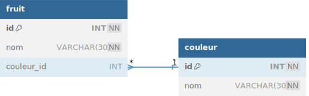
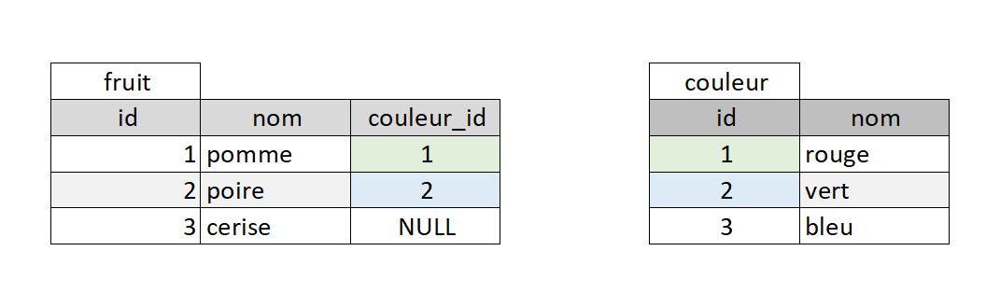
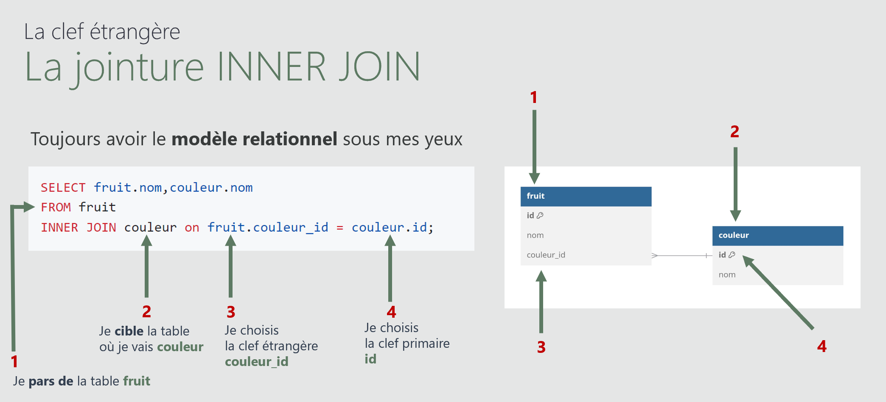
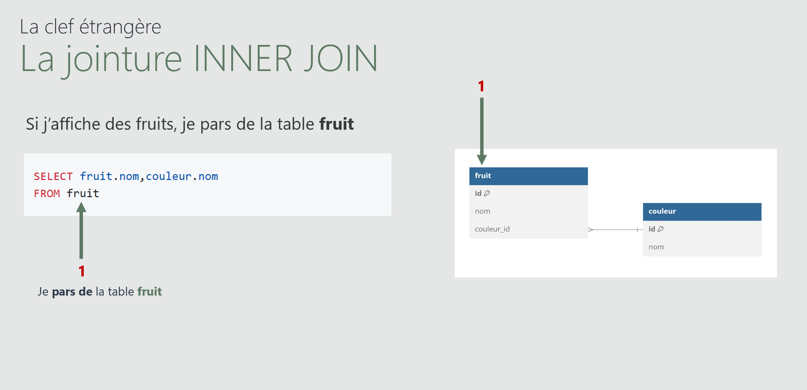
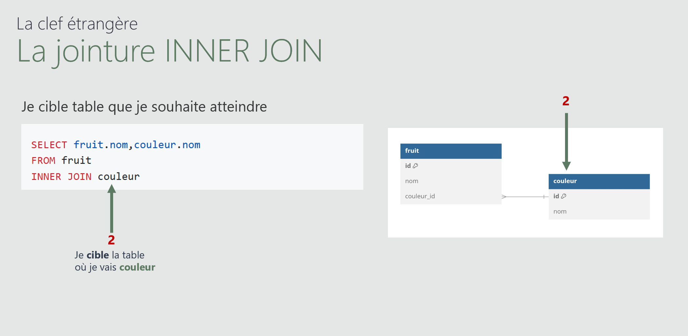
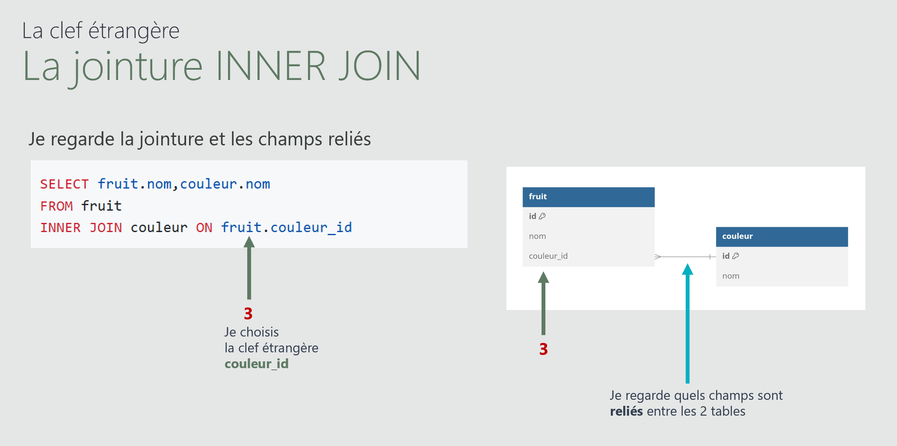
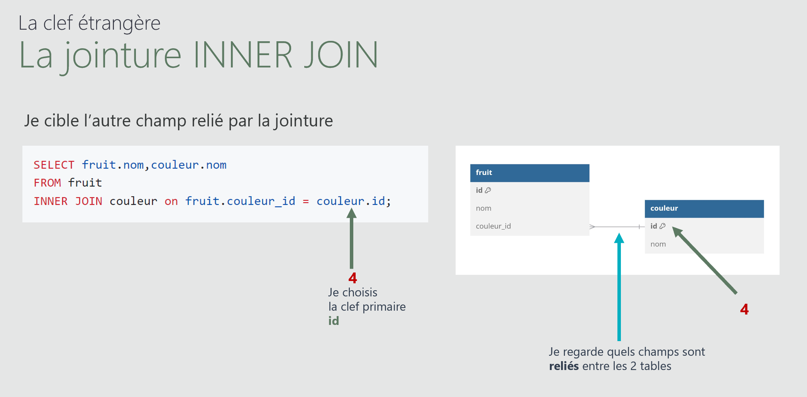

# Module 06 - Les jointures LEFT, RIGHT & INNER
<a href="../00 Les fichiers PDF - Supports de cours/06 Les jointures.pdf">
  
</a>  
<br>
<a href="../00 Les fichiers PDF - Supports de cours/06 Les jointures.pdf">
06 Les jointures
</a> 
   <br> <br>  
     
- Mise en place d'un <code>INNER JOIN</code>
- Mise en place d'un <code>LEFT JOIN</code>
- Mise en place d'un <code>RIGHT JOIN</code>
- Mise en place de <code>COUNT()</code> et <code>GROUP BY</code> avec <code>INNER JOIN</code>
- Mise en place de <code>COUNT()</code> et <code>GROUP BY</code> avec <code>LEFT JOIN</code>
  <br> <br>
**modèle relationnel**  

  


  
## Mise en Place d'un INNER JOIN
_Relier 2 tables avec <code>INNER JOIN</code>_  

 
  

### Mise en Place en 4 Etapes
_Construction d'un <code>INNER JOIN</code> en 4 étapes_ 
   
:one: Je sélectionne la table d'où je pars avec le <code>FROM</code>.  
  

:two: Je sélectionne la table 2 que je vise. la table où je veux aller.  
  

:three: Je sélectionne le  champ de la table 1 (par exemple)  
_Je visualise la jointure et les champs reliés entre eux_  
  

:four: - Je sélectionne le  champ relié de la table 2 
  

----------------------------------------------

 
  
[Documentation INNER JOIN](https://www.w3schools.com/sql/sql_join_inner.asp)

**La requête complète**
```sql
SELECT fruit.nom,couleur.nom 
FROM fruit 
INNER JOIN couleur ON fruit.couleur_id = couleur.id;
```
**Résultat obtenu**
| fruit.nom | couleur.nom  |
|---|---|
| pomme | rouge |
| poire | vert |
 


----------------------------------------------

### Utilisation du AS pour une lecture plus claire

```sql
USE salade_de_fruits;

SELECT f.nom AS fruit,c.nom AS couleur
FROM fruit AS f
INNER JOIN couleur AS c on f.couleur_id = c.id;
```

**Résultat obtenu**
| fruit | couleur  |
|---|---|
| pomme | rouge |
| poire | vert |
----------------------------------------------

  
## Mise en place du LEFT JOIN
Nous pouvons remplacer simplement les <code>INNER</code> par <code>LEFT</code>
  
    

[Documentation LEFT JOIN](https://www.w3schools.com/sql/sql_join_left.asp)

```sql
USE salade_de_fruits;

SELECT 
fruit.nom AS fruit,
couleur.nom AS nom
FROM fruit 
LEFT JOIN couleur ON fruit.couleur_id = couleur.id;
```
**Résultat obtenu**
| fruit | couleur  |
|---|---|
| pomme | rouge |
| poire | vert |
| cerise | null |

## Mise en place du  RIGHT JOIN 
    

[Documentation LEFT JOIN](https://www.w3schools.com/sql/sql_join_right.asp)

```sql
USE salade_de_fruits;

SELECT 
fruit.nom AS fruit,
couleur.nom AS nom
FROM fruit 
RIGHT JOIN couleur ON fruit.couleur_id = couleur.id;
```
**Résultat obtenu**
| fruit | couleur  |
|---|---|
| pomme | rouge |
| poire | vert |
| null | bleu |


# Compter des occurences avec INNER JOIN
_Mise en place de <code>COUNT()</code> et <code>GROUP BY</code> avec <code>INNER JOIN</code>_
On souhaite savoir chaque couleur est associée à combien de fruits
 - on compte (avec <code>COUNT()</code>) les fruits  donc les ID de fruit <code>f.id</code> OU <code>fruit.id</code>  
 - On regoupe(avec <code>GROUP BY</code>) par couleur donc Les ID de couleur <code>c.id</code> OU <code>couleur.id</code>  

    

```sql
USE salade_de_fruits;

SELECT c.nom AS couleur, COUNT(f.id) AS nb_fruit
FROM fruit AS f
INNER JOIN couleur AS c on f.couleur_id = c.id
GROUP BY (c.id);
```
**Résultat obtenu**
| couleur | couleur  |
|---|---|
| rouge | 1 |
| verte | 1 |


# Compter des occurences avec LEFT JOIN
Nous remplacons <code>INNER</code> par <code>LEFT</code>
Ainsi nous avons toutes les couleurs

    

```sql
USE salade_de_fruits;

SELECT c.nom AS couleur, COUNT(f.id) AS nb_fruit
FROM fruit AS f
INNER JOIN couleur AS c on f.couleur_id = c.id
GROUP BY (c.id);
```
**Résultat obtenu**
| couleur | couleur  |
|---|---|
| rouge | 1 |
| verte | 1 |
| bleu | 0 |