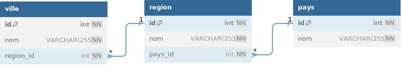

# Les jointures sur 3 tables

Avec plusieurs <code>INNER JOIN</code>  
Avec Plusieurs <code>LEFT JOIN</code>




**La base de données & les data**

```sql
DROP DATABASE IF EXISTS le_village;
CREATE DATABASE le_village CHARACTER SET utf8mb4 COLLATE utf8mb4_unicode_ci;

######################################
# Les tables
######################################

CREATE TABLE pays (
  id INT NOT NULL AUTO_INCREMENT,
  nom VARCHAR(255) NOT NULL,
  CONSTRAINT pk_pays PRIMARY KEY (id)
)ENGINE=INNODB;

CREATE TABLE region (
  id int NOT NULL AUTO_INCREMENT,
  nom VARCHAR(255) NOT NULL,
  pays_id int NOT NULL,
  CONSTRAINT pk_region PRIMARY KEY (id)
)ENGINE=INNODB;

CREATE TABLE ville (
  id int NOT NULL AUTO_INCREMENT,
  nom VARCHAR(255) NOT NULL,
  region_id int NOT NULL,
  CONSTRAINT pk_ville PRIMARY KEY (id)
)ENGINE=INNODB;


ALTER TABLE region ADD CONSTRAINT fk_pays FOREIGN KEY (pays_id) REFERENCES pays (id);
ALTER TABLE ville ADD CONSTRAINT fk_region FOREIGN KEY (region_id) REFERENCES region (id);

######################################
# Les DATA
######################################

INSERT INTO pays (id, nom) VALUES
(1, 'France'),
(2, 'Belgique');

INSERT INTO region (id, nom, pays_id) VALUES
(2, 'Bretagne', 1);

INSERT INTO ville (id, nom, region_id) VALUES
(1, 'Rennes', 2),
(2, 'Brest', 2);
```


## Afficher les villes par pays
| pays | ville |
|---|---|
| France | Rennes |
| France | Brest |

```sql
USE le_village;

SELECT
pays.nom,
ville.nom
FROM pays
INNER JOIN region ON pays.id = region.pays_id
INNER JOIN ville ON region.id = ville.region_id;
```

## Afficher les villes avec la region et le pays


```sql
USE le_village;

SELECT
ville.nom AS ville,
region.nom AS region,
pays.nom AS pays
FROM ville
INNER JOIN region ON ville.region_id = region.id
INNER JOIN pays ON region.pays_id= pays.id
```
| pays | region | ville |
|---|---|---|
| France | Bretagne | Rennes |
| France | Bretagne | Brest |


## Afficher Le nombre de villes par pays

_Même les pays avec 0 ville_

```sql
USE le_village;

SELECT
pays.nom AS pays,
CONT(ville.id)  AS nb_ville
FROM pays
INNER JOIN region ON pays.id = region.pays_id
INNER JOIN ville ON region.id = ville.region_id;
GROUP BY (pays.id)
```
| pays | nb_ville |
|---|---|
| France | 2 | 
| Belgique | 0 | 

# Bonus : pseudo code pour db diagram
  

[db Diagram](https://dbdiagram.io/home) 
**prompt db diagram :**


```
Table pays {
  id int [pk, not null, increment]
  nom VARCHAR(255) [not null]
}
Table region {
  id int [pk, not null, increment]
  nom VARCHAR(255) [not null]
  pays_id int [not null]
}
Table ville {
  id int [pk, not null, increment]
  nom VARCHAR(255) [not null]
  region_id int [not null]
}
Ref: "pays"."id" < "region"."pays_id"
Ref: "region"."id" < "ville"."region_id"
```