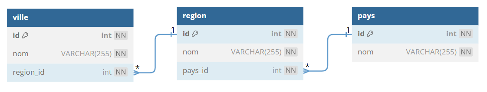
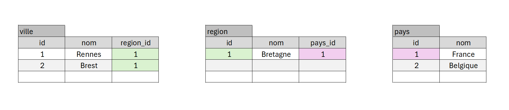
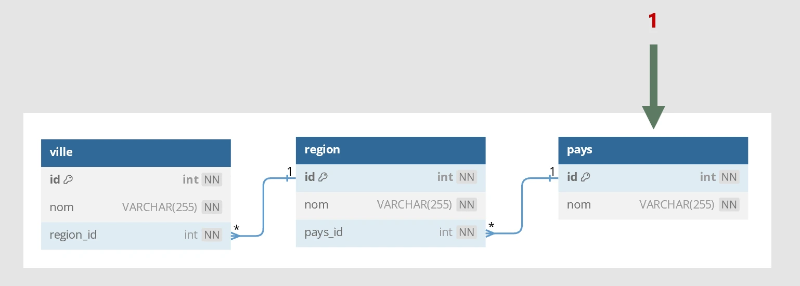
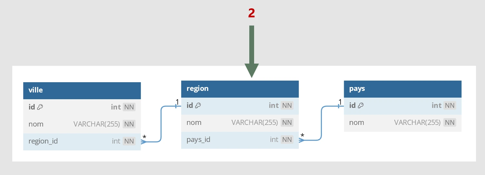
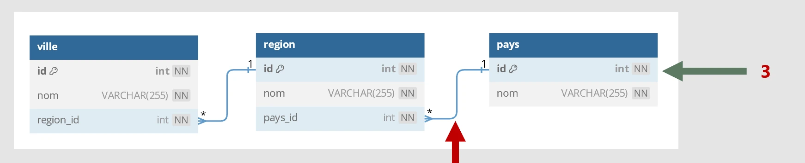
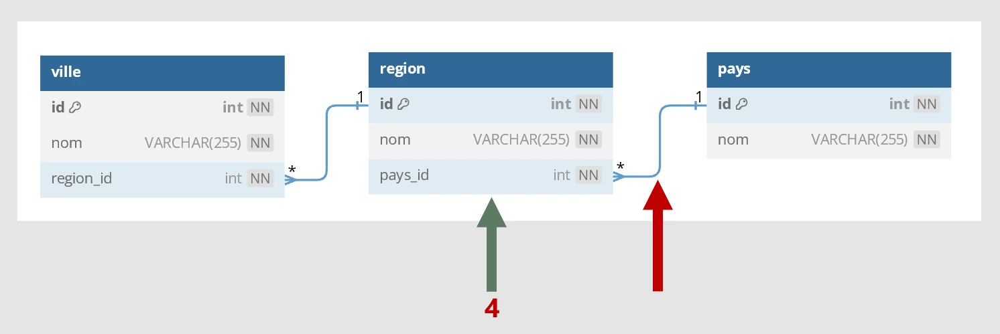
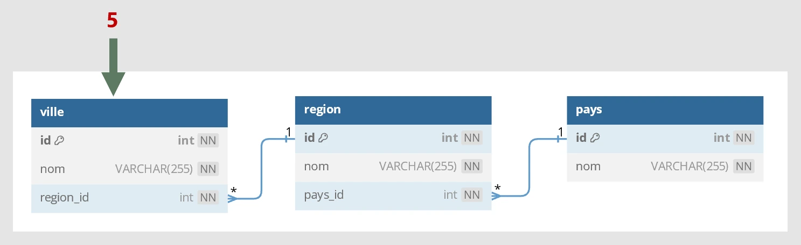
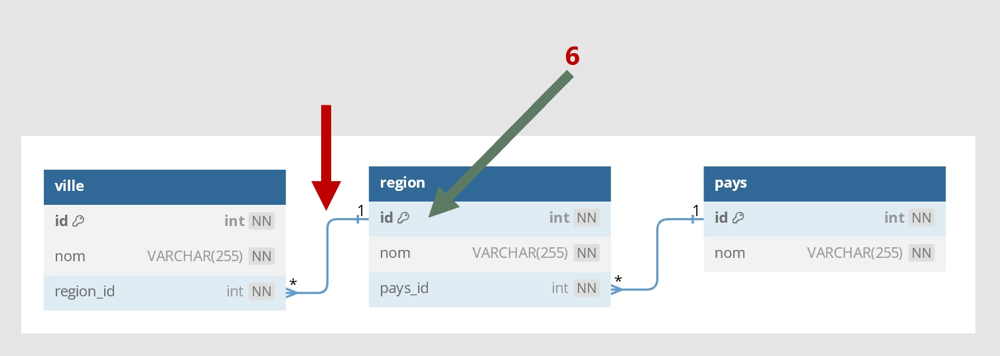
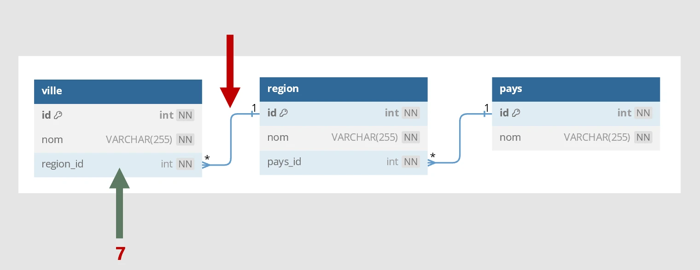

# Module 07 - Mise en place de plusieurs jointures
<a href="../00 Les fichiers PDF - Supports de cours/07 Mise en place de plusieurs jointures.pdf">
  
</a>  
<br>
<a href="../00 Les fichiers PDF - Supports de cours/07 Mise en place de plusieurs jointures.pdf">
LE PDF : 07 La table de jointure
</a> 

***Extraire les données de plusieurs tables relier par des jointures***

Avec plusieurs <code>INNER JOIN</code>  
Avec Plusieurs <code>LEFT JOIN</code>





## La base de données & les données

```sql
DROP DATABASE IF EXISTS le_village;
CREATE DATABASE le_village CHARACTER SET utf8mb4 COLLATE utf8mb4_unicode_ci;
USE le_village;
######################################
# Les tables
######################################

CREATE TABLE pays (
  id INT NOT NULL AUTO_INCREMENT,
  nom VARCHAR(255) NOT NULL,
  CONSTRAINT pk_pays PRIMARY KEY (id)
)ENGINE=INNODB;

CREATE TABLE region (
  id int NOT NULL AUTO_INCREMENT,
  nom VARCHAR(255) NOT NULL,
  pays_id int NOT NULL,
  CONSTRAINT pk_region PRIMARY KEY (id)
)ENGINE=INNODB;

CREATE TABLE ville (
  id int NOT NULL AUTO_INCREMENT,
  nom VARCHAR(255) NOT NULL,
  region_id int NOT NULL,
  CONSTRAINT pk_ville PRIMARY KEY (id)
)ENGINE=INNODB;


ALTER TABLE region ADD CONSTRAINT fk_pays FOREIGN KEY (pays_id) REFERENCES pays (id);
ALTER TABLE ville ADD CONSTRAINT fk_region FOREIGN KEY (region_id) REFERENCES region (id);

######################################
# Les DATA
######################################

INSERT INTO pays (id, nom) VALUES
(1, 'France'),
(2, 'Belgique');

INSERT INTO region (id, nom, pays_id) VALUES
(2, 'Bretagne', 1);

INSERT INTO ville (id, nom, region_id) VALUES
(1, 'Rennes', 2),
(2, 'Brest', 2);
```


## Afficher les villes par pays
| pays | ville |
|---|---|
| France | Rennes |
| France | Brest |


__**Créer la requête SQL en 7 étapes !**__

-----------------------------------------------------------
:one: Je pars de la table <code>pays</code> 
   


```sql
SELECT
pays.nom
FROM pays

```

-----------------------------------------------------------
:two: Je cible la table region <code>pays</code>  
  


```sql

SELECT
pays.nom
FROM pays
INNER JOIN region

```

-----------------------------------------------------------
:three: Je regarde la jointure entre les 2 tables  
Je prends le champ <code>id</code> qui pars de la table<code>pays</code> 
  


```sql

SELECT
pays.nom
FROM pays
INNER JOIN region ON pays.id

```

-----------------------------------------------------------
:four: Je regarde la jointure entre les 2 tables  
Je prends le champ <code>pays_id</code>sur la table<code>region</code> 
  


```sql

SELECT
pays.nom
FROM pays
INNER JOIN region ON pays.id = region.pays_id

```

-----------------------------------------------------------
:five: Je cible la table <code>ville</code>



```sql

SELECT
pays.nom
FROM pays
INNER JOIN region ON pays.id = region.pays_id
INNER JOIN ville 

```
-----------------------------------------------------------
:six: Je regarde la jointure entre les 2 tables  
Je prends le champ <code>id</code> qui pars de la table<code>region</code> 



```sql

SELECT
pays.nom
FROM pays
INNER JOIN region ON pays.id = region.pays_id
INNER JOIN ville ON region.id

```

-----------------------------------------------------------
:seven: Je regarde la jointure entre les 2 tables  
Je prends le champ <code>region_id</code> sur la table<code>ville</code> 



```sql

SELECT
pays.nom,ville.nom
FROM pays
INNER JOIN region ON pays.id = region.pays_id
INNER JOIN ville ON region.id = ville.region_id

```
-----------------------------------------------------------
-----------------------------------------------------------
Et voilà !  :smiley: :heart_eyes:
```sql
USE le_village;
# afficher les villes par pays
SELECT
pays.nom AS pays,
ville.nom AS nom
FROM pays
INNER JOIN region ON pays.id = region.pays_id
INNER JOIN ville ON region.id = ville.region_id;
```
| pays | ville |
|---|---|
| France | Rennes |
| France | Brest |

-----------------------------------------------------------
-----------------------------------------------------------


## Afficher Le nombre de villes par pays
_Même les pays avec 0 ville_

On remplace les <code>INNER</code> par <code>LEFT</code>

```sql
USE le_village;

SELECT
pays.nom AS pays,
COUNT(ville.id)  AS nb_ville
FROM pays
LEFT JOIN region ON pays.id = region.pays_id
LEFT JOIN ville ON region.id = ville.region_id;
GROUP BY (pays.id)
```
| pays | nb_ville |
|---|---|
| France | 2 | 
| Belgique | 0 | 


## Afficher les villes avec la region et le pays


```sql
USE le_village;

SELECT
ville.nom AS ville,
region.nom AS region,
pays.nom AS pays
FROM ville
INNER JOIN region ON ville.region_id = region.id
INNER JOIN pays ON region.pays_id= pays.id
```
| pays | region | ville |
|---|---|---|
| France | Bretagne | Rennes |
| France | Bretagne | Brest |


# Bonus : pseudo code pour db diagram
  

[db Diagram](https://dbdiagram.io/home) 
**prompt db diagram :**


```
Table pays {
  id int [pk, not null, increment]
  nom VARCHAR(255) [not null]
}
Table region {
  id int [pk, not null, increment]
  nom VARCHAR(255) [not null]
  pays_id int [not null]
}
Table ville {
  id int [pk, not null, increment]
  nom VARCHAR(255) [not null]
  region_id int [not null]
}
Ref: "pays"."id" < "region"."pays_id"
Ref: "region"."id" < "ville"."region_id"
```