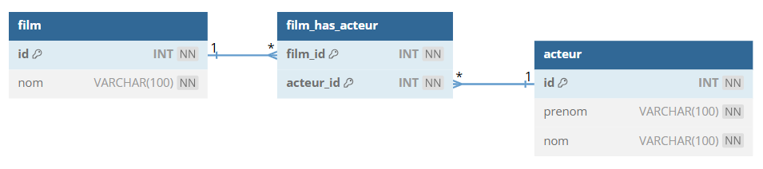

# TP 8 - Film avec acteurs - table de jointures


## Le modèle relationnel


## Les données


## Pour rappel voici la structure de la table avec les données
```sql
DROP DATABASE IF EXISTS prime_vdo;
CREATE DATABASE prime_vdo CHARACTER SET utf8mb4 COLLATE utf8mb4_unicode_ci;
USE prime_vdo;

CREATE TABLE film (
  id INT  NOT NULL AUTO_INCREMENT,
  nom VARCHAR(100) NOT NULL,
  CONSTRAINT pk_film PRIMARY KEY(id)
)ENGINE=INNODB;

CREATE TABLE acteur (
  id INT NOT NULL AUTO_INCREMENT,
  prenom VARCHAR(100) NOT NULL,
  nom VARCHAR(100) NOT NULL,
   CONSTRAINT pk_acteur PRIMARY KEY(id)
)ENGINE=INNODB;

CREATE TABLE film_has_acteur (
  film_id INT NOT NULL,
  acteur_id INT NOT NULL,
  CONSTRAINT pk_film_has_acteur PRIMARY KEY (film_id, acteur_id)
)ENGINE=INNODB;

ALTER TABLE film_has_acteur ADD CONSTRAINT fk_acteur FOREIGN KEY (acteur_id) REFERENCES acteur (id);
ALTER TABLE film_has_acteur ADD CONSTRAINT fk_film FOREIGN KEY (film_id) REFERENCES film (id);

##############
## Les données
##############

INSERT INTO acteur (id, prenom, nom) VALUES
(1, 'Brad', 'PITT'),
(2, 'Léonardo', 'Dicaprio');

INSERT INTO film (id, nom) VALUES
(1, 'Fight Club'),
(2, 'Once Upon a time in Hollywood');

INSERT INTO film_has_acteur 
(film_id, acteur_id) 
VALUES 
('1', '1'), 
('2', '1'), 
('2', '2');
```


:one: Afficher tous les films de Brad PITT 

| film | acteur_prenom | acteur_nom |
|--- |--- |--- |
|Once Upon the time |  Brad | PITT |
|Fight Club |  Brad | PITT |

:two: Afficher le nombre de films par acteur 
| acteur_prenom | acteur_nom |  nb_films | 
|--- |--- |--- |
|  Leonardo | DICAPRIO | 1|
| Brad | PITT | 2 |

:three: Ajouter un film :TITANIC   
:four: Trouver le film qui n'a pas d'acteur

| film | 
|--- |
|  TITANIC |
:five: Associer Leonardo DICAPRIO dans le film TITANIC  

:six: Afficher tous les film avec acteurs avec <code>COUNT ()</code> et <code>BROUP BY</code>
 | film | acteur_prenom | acteur_nom |
|--- |--- |--- |
|Once Upon the time |  Leonardo | DICAPRIO |
|Once Upon the time |  Brad | PITT |
|Fight Club |  Brad | PITT |
|TITANIC |  Leonardo | DICAPRIO |

:seven: Ajouter un acteur TOM CRUISE

:eight: Afficher le nombre de films par acteur en incluant TOM CRUISE
| acteur_prenom | acteur_nom |  nb_films | 
|--- |--- |--- |
|  Leonardo | DICAPRIO | 2 |
| Brad | PITT | 2 |
| TOM | CRUISE | 0 |

**9** - Afficher les acteurs ayant jouer dans 2 films avec <code>HAVING</code>
| acteur_prenom | acteur_nom |  nb_films | 
|--- |--- |--- |
|  Leonardo | DICAPRIO | 2|
| Brad | PITT | 2 |


**10** - En moyenne Combien d'acteurs jouent dans 1 film ?
| acteur_par_film |
|--- |
| 1,3333 |


**11** - Effacer les 3 tables avec <code>DROP TABLE</code> 
