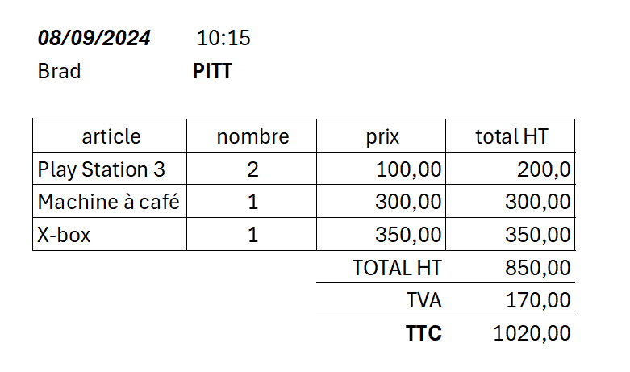

# TP 9 - SITE E-commerce

<table>
<tr>
<td valign=top>

  
### la table article
| id | nom | prix | 
|----|---|---|
| 1 | PlayStation 5 | 400.00 |
| 2 | X box | 350.00 |
| 3 | Machine à café | 300.00 |
| 4 | PlayStation 3 | 100.00 |

</td><td valign=top>

### la table client
| id | nom | prenom | 
|----|---|---|
| 1 | Brad | PITT |
| 2 | George | Cloney |
| 3 | Jean | DUJARDIN |

</td></tr></table>
  
   

  
:one: Créer la base de données   
:two: Créer les tables  
:three: Ajouter les données  

:four: Afficher la commande de Brad PITT  
|prenom|nom|date_achat|nom|prix|nb|total|
|---|---|---|---|---|---|---|
|PITT|Brad|2024-09-08 10:15:00|X box|350|1|350|
|PITT|Brad|2024-09-08 10:15:00|Machine à café|300|1|300|
|PITT|Brad|2024-09-08 10:15:00|PlayStation 3|100|2|200|

|total_ht|total_tva|total_ttc|
|---|---|---|
|850|170|1020|

# Bonus : Créer la base de données sur db diagram

[db Diagram](https://dbdiagram.io/home) 
