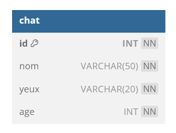

# TP 1 - Le monde des les chats
## :warning: La correction
     
  
| id | nom | yeux | age |
|---|---|---|---|
| 1 | Maine coon | marron | 20 |
| 2 | Siamois | bleu | 15 |
| 3 | Bengal | marron | 18 |
| 4 | Scottish Fold | marron | 10 |
  


:one: Créer la data base **zoo**  
:two: Créer la table **chat**  
## Le modèle Relationnel


# Correction structure de la table

```sql
-- Supprimer le Data Base si elle existe
DROP DATABASE IF EXISTS zoo;
-- CREATION DATA BASE
CREATE DATABASE zoo CHARACTER SET utf8mb4 COLLATE utf8mb4_unicode_ci;

USE zoo;

CREATE TABLE IF NOT EXISTS chat(
 id INT NOT NULL AUTO_INCREMENT,
 nom VARCHAR(50) NOT NULL,
 yeux VARCHAR(20) NOT NULL,
 age INT NOT NULL,
 CONSTRAINT pk_chat PRIMARY KEY (id)
)ENGINE=INNODB;
```
