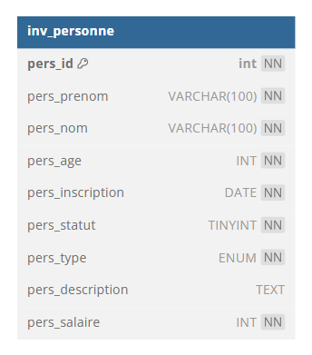

# :cocktail: TP 2 - VIP Cocktail
## :warning: La correction
   

Nou allons créer une liste d'invités pour des soirées VIP  


  

## Partie 1 - Création de la table
Chaque personne a :
  
- un prénom
- un nom  
- un age  
- la date de sont inscription
- un etat : Valide ou NON Valide (un booléen)
- un statut : membre ou non membre (une énumération)
- un  CV
- salaire annuel
  
| id | prenom | nom | age | inscription | etat | statut | cv | salaire |
|---|---|---|---|---|---|---|---|---|
| 1 | Brad | PITT | 60 | 01/01/1970 | 1 | non membre | lorem ipsum | 2 000 000 |
| 2 | George | CLONEY | 62 | 01/01/1999 | 1 | membre  | juste beau | 4 000 000 |
| 3 | Jean | DUJARDIN | 51 | 01/01/1994 | 0 | membre | brice de nice | 1 000 000 |


:one: Créer une base de donnée : **invitation**  
:two: Créer une table : **personne**  
:three: Rajouter le prefixe <code>inv_</code> à votre table  
   
## Le modèle relationnel



## La correction  :heart_eyes: :
```sql

DROP DATABASE IF EXISTS invitation;
CREATE DATABASE invitation CHARACTER SET utf8mb4 COLLATE utf8mb4_unicode_ci;

USE invitation;
DROP TABLE IF EXISTS inv_personne;
CREATE TABLE inv_personne(
    id int NOT NULL AUTO_INCREMENT, 
    prenom VARCHAR(100) NOT NULL,
    nom VARCHAR(100) NOT NULL,
    age INT NOT NULL,
    inscription DATE NOT NULL,
    etat TINYINT NOT NULL DEFAULT 1, -- 1 ok 0 pas ok
    statut ENUM('membre','non membre') NOT NULL DEFAULT 'non membre',
    cv TEXT, -- peut etre null / si on ne met pas NULL
    salaire INT NOT NULL,
    CONSTRAINT pk_personne PRIMARY KEY(id) # pk_personne le nom de la contrainte de clef primaire
) ENGINE=InnoDB; 
 
```
