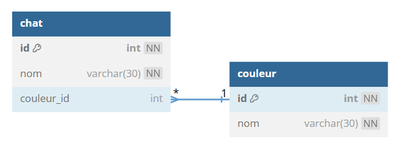
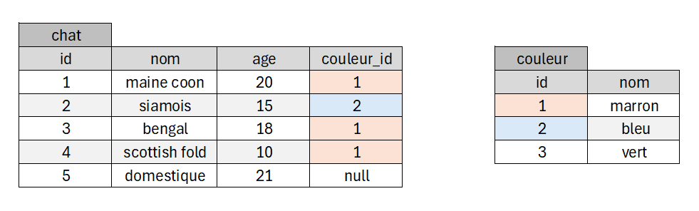

# TP 5 - Le mondes des chats avec une clef étrangère
## :warning: La correction

   






# Objectifs :
:one: Création de la base de données **spa**  
:two: Création de la table **chat**  
:three: Creation de la table **couleur**  
```sql
# 1 Création de la base de données spa
DROP DATABASE IF EXISTS spa;
-- CREATION DE LA DATA BASE
CREATE DATABASE spa CHARACTER SET utf8mb4 COLLATE utf8mb4_unicode_ci;
USE spa;

# 2 Création de la table chat  
CREATE TABLE chat (
 id int NOT NULL AUTO_INCREMENT,
 nom VARCHAR(50) NOT NULL,
 age INT NOT NULL,
 couleur_id int NULL, # le champ peut etre null
 CONSTRAINT pk_chat PRIMARY KEY (id)
)ENGINE=INNODB;

# 3 Creation de la table couleur 
CREATE TABLE couleur (
 id int NOT NULL AUTO_INCREMENT,
 nom VARCHAR(50) NOT NULL,
 CONSTRAINT pk_couleur PRIMARY KEY (id)
)ENGINE=INNODB;

ALTER TABLE chat ADD CONSTRAINT fk_couleur FOREIGN KEY (couleur_id) REFERENCES couleur(id);
```

:four: Insérer  les données  
```sql
USE spa;

# 1 on commence par la table couleur
INSERT INTO couleur (nom) VALUES
('marron'),
('bleu'),
('vert');

# 1 ensuite la table chat
INSERT INTO chat (nom,age,couleur_id) VALUES
('maine coon',20,1),
('siamois',15,2),
('bengal',18,1),
('scottish fold',10,1),
('domestique',21,null);
```

# Je teste et j'affiche
```sql
USE spa;

SELECT  nom FROM chat; 
```
| nom | 
|---|
| maine coon |
| siamois |
| bengal | 
| scottish fold |
| domestique |

-----------------------------------------------

```sql
USE spa;

SELECT  nom FROM couleur; 
```
| nom | 
|---|
| marron |
| bleu |
| vert | 
-----------------------------------------------

:five: Afficher les chats avec les couleurs des yeux avec <code>INNER JOIN</code>
| id | nom | yeux | age |
|---|---|---|---|
| 1 | Maine coon | marron | 20 |
| 2 | Siamois | bleu | 15 |
| 3 | Bengal | marron | 18 |
| 4 | Scottish Fold | marron | 10 | 
```sql
USE spa;
# id	nom	yeux	age
SELECT
chat.id AS id,
chat.nom AS nom,
couleur.nom AS yeux,
chat.age AS age
FROM chat
INNER JOIN couleur
ON chat.couleur_id = couleur.id
```
:six: Afficher les chats avec les couleurs des yeux avec le chat domestique avec <code>LEFT JOIN</code>
| id | nom | yeux | age |
|---|---|---|---|
| 1 | Maine coon | marron | 20 |
| 2 | Siamois | bleu | 15 |
| 3 | Bengal | marron | 18 |
| 4 | Scottish Fold | marron | 10 | 
| 5 | Domestique | PAS DE COULEURS | 21 | 
```sql
USE spa;
# id	nom	yeux	age
SELECT
chat.id AS id,
chat.nom AS nom,
 COALESCE(couleur.nom,'PAS DE COULEUR') AS yeux,
chat.age AS age
FROM chat
LEFT JOIN couleur
ON chat.couleur_id = couleur.id
```

:seven: Afficher le chat qui n'a pas de couleur des yeux
| id | nom | age |
|---|---|---|
| 5 | Domestique | 21 | 
```sql
USE spa;

SELECT
chat.id AS id,
chat.nom AS nom,
chat.age AS age
FROM chat
WHERE couleur_id IS NULL;
```
:eight: Afficher le nombre de chats par couleur des yeux
| couleur | nb_chat |
|---|---|
| marron | 3 |
| bleu | 1 |
```sql
USE spa;

SELECT
couleur.nom AS couleur,
COUNT(chat.id) AS nb_chat
FROM couleur
INNER JOIN chat 
ON couleur.id = chat.couleur_id
GROUP BY(couleur.id)
```
**autre possibilité**
```sql
USE spa;

SELECT
couleur.nom AS couleur,
COUNT(chat.id) AS nb_chat
FROM chat
INNER JOIN couleur
ON chat.couleur_id = couleur.id
GROUP BY (couleur.id);
```


:nine: Afficher le nombre de chats par couleur des yeux avec la couleur "vert"
| couleur | nb_chat |
|---|---|
| marron | 3 |
| bleu | 1 |
| vert | 0 |
```sql
SELECT
couleur.nom AS couleur,
COUNT(chat.id) AS nb_chat
FROM couleur
LEFT JOIN chat 
ON couleur.id = chat.couleur_id
GROUP BY(couleur.id)
```
**autre possibilité**
```sql
USE spa;

SELECT
couleur.nom AS couleur,
COUNT(chat.id) AS nb_chat
FROM chat
RIGHT JOIN couleur
ON chat.couleur_id = couleur.id
GROUP BY (couleur.id);
```

**10** Afficher la moyenne de couleur des yeux attribuer par chat :cactus::cactus::cactus::cactus:  
| moyenne_couleur_yeux |
|---|
| 1.3333 |

```sql
USE spa;

SELECT avg(info.nb_chat) as moyenne_couleur_yeux 
FROM(
SELECT
	couleur.nom AS couleur,
	COUNT(chat.id) AS nb_chat
	FROM couleur
	LEFT JOIN chat 
	ON couleur.id = chat.couleur_id
	GROUP BY(couleur.id)) as info ;
  ```
# Bonus : pseudo code pour db diagram

  

[db Diagram](https://dbdiagram.io/home) 
**prompt db diagram :**
```
Table couleur{
  id int [pk,not null, increment]
  nom varchar(30) [not null]
}
Table chat{
  id int [pk,not null, increment]
  nom varchar(30) [not null]
  couleur_id int [null]
}
Ref: "couleur"."id" < "chat"."couleur_id"
```