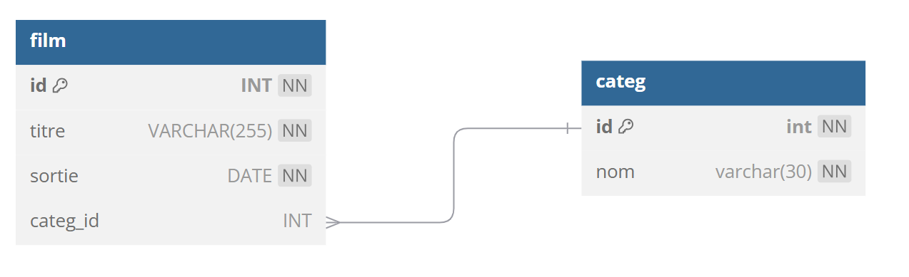

# TP 6 - Les films avec catégories
## :warning: La correction

 


  


| id | titre | sortie | categorie |
|---|---|---|---|
| 1 | STAR WARS | 1977/05/25 | Sciences Fiction |
| 2 | THE MATRIX | 1999/06/23 | Sciences Fiction |
| 3 | PULP FICTION | 1994/10/26 | Thriller |

# Objectifs :
:one: Création de la base de données **netflix**  
:two: Création de la table **film**  
:three: Création de la table **categ**  
:four: Insérer  les données  
```sql

# 1 Création de la base de données
DROP DATABASE IF EXISTS netflix;
CREATE DATABASE netflix CHARACTER SET utf8mb4 COLLATE utf8mb4_unicode_ci;
USE netflix;

# 2 table film
CREATE TABLE film (
    id INT NOT NULL AUTO_INCREMENT,
    titre VARCHAR(255) NOT NULL,
    sortie DATE NOT NULL,
    categ_id INT NULL,
    CONSTRAINT pk_film PRIMARY KEY(id)
) ENGINE=InnoDB; 

# 3 table categ
CREATE TABLE categ (
 id int NOT NULL AUTO_INCREMENT,
 nom VARCHAR(50) NOT NULL,
 CONSTRAINT pk_categ PRIMARY KEY (id)
)ENGINE=INNODB;

ALTER TABLE film ADD CONSTRAINT fk_categ FOREIGN KEY (categ_id) REFERENCES categ(id);
```

:four: Insérer  les données
```sql
USE netflix;
INSERT INTO categ (nom) VALUES
('Science fiction'),
('Thriller');

INSERT INTO film (titre,sortie,categ_id) VALUES
('STAR WARS','1977/05/25',1),
('THE MATRIX','1999/06/23',1),
('PULP FICTION','1994/10/26',2);
```  

:five: Afficher tous les films de Science fiction
| id | titre | sortie | categorie |
|---|---|---|---|
| 1 | STAR WARS | 1977/05/25 | Science Fiction |
| 2 | THE MATRIX | 1999/06/23 | Science Fiction |

:six: Afficher Le nombre de films de Science Fiction
| categorie | nb_film |
|---|---|
| Science Fiction | 2 |

:seven: Afficher Le nombre de films de Science Fiction
| categorie | nb_film |
|---|---|
| Science Fiction | 2 |

:seven: Afficher Le nombre de films par catégorie

| categorie | nb_film |
|---|---|
| Science Fiction | 2 |
| Thriller | 1 |
