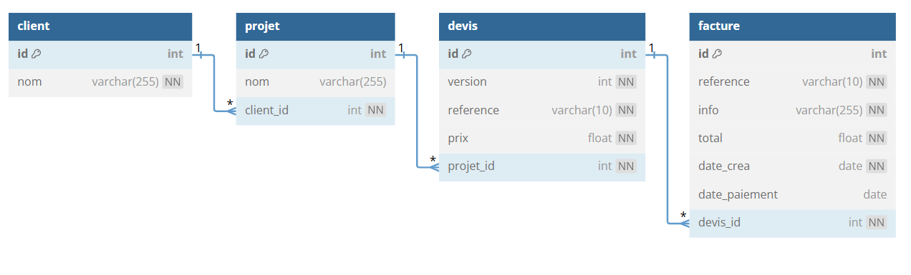

# TP 7 - CRM Customer  Relationship Management
## :warning: La correction

  
  

## Modèle relationnel



# Partie 1
##  Créer la base de données  en 4 étape  
  11 - Créer la table client & Ajouter les données de client  
  12 - Créer la table projet & Ajouter les données de projet  
  13 - Créer la table devis & Ajouter les données de devis    
  14 - Créer la table facture & Ajouter les données de facture  

```sql
DROP DATABASE IF EXISTS my_crm;
CREATE DATABASE my_crm CHARACTER SET utf8mb4 COLLATE utf8mb4_unicode_ci;
USE my_crm;


CREATE TABLE client (
 id INT NOT NULL AUTO_INCREMENT,
 nom VARCHAR(255) NOT NULL,
 CONSTRAINT pk_client PRIMARY KEY (id)
)ENGINE=INNODB;

CREATE TABLE projet(
 id INT NOT NULL AUTO_INCREMENT,
 client_id INT NOT NULL,
 nom VARCHAR(255) NOT NULL,
 CONSTRAINT pk_projet PRIMARY KEY (id)
)ENGINE=INNODB;

CREATE TABLE devis(
 id INT NOT NULL AUTO_INCREMENT,
 version INT NOT NULL,
 reference VARCHAR(10) NOT NULL,
 prix FLOAT NOT NULL,
 projet_id INT NOT NULL,
 CONSTRAINT pk_devis PRIMARY KEY (id)
)ENGINE=INNODB;

CREATE TABLE facture(
 id INT NOT NULL AUTO_INCREMENT,
 reference VARCHAR(10) NOT NULL,
 info VARCHAR(255) NOT NULL,
 total FLOAT NOT NULL,
 date_crea DATE NOT NULL,
 date_paiement DATE NULL,
 devis_id INT NOT NULL,
 CONSTRAINT pk_facture PRIMARY KEY (id)
)ENGINE=INNODB;

-- fk_client dans table projet
ALTER TABLE projet 
ADD CONSTRAINT fk_client 
FOREIGN KEY projet(client_id) 
REFERENCES client(id);

-- fk_projet dans table devis
ALTER TABLE devis 
ADD CONSTRAINT fk_projets 
FOREIGN KEY devis(projet_id) 
REFERENCES projet(id);

-- fk_devis dans table facture
ALTER TABLE facture 
ADD CONSTRAINT fk_devis 
FOREIGN KEY facture(devis_id) 
REFERENCES devis(id);
```  
## 2 - Ajouter les données  
```sql
USE my_crm;
-- LES DATA
INSERT INTO client (nom) VALUES 
	('Mairie de Rennes'),
	('Neo Soft'),
	('Sopra'),
	('Accenture'),
	('Amazon');
INSERT INTO projet (nom, client_id) VALUES
	('Création de site internet', 1),
	('Logiciel CRM', 2),
	('Logiciel de devis', 3),
	('Site internet e-commerce', 4),
	('Logiciel ERP', 2),
	('Logiciel gestion de stock',5);

INSERT INTO devis (version,reference, prix, projet_id) VALUES
	('1','DEV2100A', 3000, 1),
	('2','DEV2100B', 5000, 1),
	('1','DEV2100C', 5000, 2),
	('1','DEV2100D', 3000, 3),
	('1','DEV2100E', 5000, 4),
	('1','DEV2100F', 2000, 5),
	('1','DEV2100G', 1000, 6);

INSERT INTO facture (reference,info,total,devis_id,date_crea,date_paiement)	
    VALUES
	('FA001', 'site internet partie 1', 1500, 1, '2023-09-01','2023-10-01'),
	('FA002', 'site internet partie 2', 1500, 1, '2023-09-20',null),
	('FA003', 'logiciel CRM', 5000, 3, '2024-02-01',null),
	('FA004', 'logiciel devis', 3000, 4, '2024-03-03','2024-04-03'),
	('FA005', 'site ecommerce', 5000, 5, '2023-03-01',null),
	('FA006', 'logiciel ERP', 2000, 6, '2023-03-01',null);
```  
# Partie 2


:one: Afficher toutes les factures avec le nom des clients
| ref | client | info | total | date | paiement | 
|--- |--- |--- |--- |--- |--- |
|FA001|Mairie de Rennes |site internet partie 1	|1500|2023-09-01|2023-10-01|
|FA002|Mairie de Rennes |site internet partie 2	|1500|2023-09-20||	
|FA003|Neo Soft |logiciel CRM|5000|2024-02-01||	
|FA004|Sopra |logiciel devis|3000|2024-03-03|2024-04-03||
|FA005|Accenture |site ecommerce|5000|2023-03-01| |	
|FA006|Neo Soft|	logiciel ERP|2000|2023-03-01| |	  

```sql
USE my_crm;
SELECT 
client.nom,
facture.reference,
facture.info,
facture.total,
facture.date_crea, 
facture.date_paiement

FROM facture 
INNER JOIN devis ON facture.devis_id =devis.id
INNER JOIN projet ON devis.projet_id = projet.id
INNER JOIN client ON projet.client_id =client.id
```
## autre possiblilé
```sql
USE my_crm;
SELECT 
client.nom,
facture.reference,
facture.info,
facture.total,
facture.date_crea, 
facture.date_paiement

FROM client  
INNER JOIN projet ON client.id = projet.client_id
INNER JOIN devis ON projet.id =devis.projet_id
INNER JOIN facture ON devis.id =facture.devis_id;
```

:two: Afficher le nombre de factures par client 
_Afficher 0 factures si il n'y a pas de factures_  
    
 | client | nb_factures|
|--- |--- |
|Mairie de Rennes |2|
|Neo Soft |2|
|Sopra |1|
|Accenture |1 |
|Amazon |0|
  
```sql
USE my_crm;
SELECT 
client.nom,
COUNT(facture.id) AS nb_factures
FROM client  
LEFT JOIN projet ON client.id = projet.client_id
LEFT JOIN devis ON projet.id =devis.projet_id
LEFT JOIN facture ON devis.id =facture.devis_id
GROUP BY(client.nom)
```
- autre possibilité avec RIGHT join
```sql
USE my_crm;
SELECT 
client.nom,
count(facture.id) AS nb_factures


FROM facture 
RIGHT JOIN devis ON facture.devis_id =devis.id
RIGHT JOIN projet ON devis.projet_id = projet.id
RIGHT JOIN client ON projet.client_id =client.id
GROUP BY(client.id)
```

:three: Afficher le chiffre d'affaire par client   
  
| client | ca_par_client|
|--- |--- |
|Mairie de Rennes |3000|
|Neo Soft |7000|
|Sopra |3000|
|Accenture |5000 |
|Amazon| |

```sql
USE my_crm;
SELECT client.nom , 
 SUM(facture.total) AS ca_par_client
FROM client
LEFT JOIN projet ON projet.client_id = client.id
LEFT JOIN devis ON devis.projet_id = projet.id
LEFT JOIN facture ON facture.devis_id = devis.id
GROUP BY (client.id);
```

:four: Afficher le CA total  avec <code>SUM()</code>  pour additioner les champs  [w3 school SUM()](https://www.w3schools.com/mysql/mysql_count_avg_sum.asp)  

| ca_total |
|--- |
|18000|

```sql
USE my_crm;

SELECT 
 SUM(total) AS ca_total
FROM facture;
```  
:five: Afficher  la somme des factures en attente de paiement 
| total_factures |
|--- |
|13500|
```sql
USE my_crm;

SELECT SUM(total) FROM facture WHERE date_paiement IS NULL;
```
- autre possibilité avec le nom client
```sql
USE my_crm;

SELECT 
client.nom,
facture.reference,
facture.info,
facture.total,
facture.date_crea
FROM facture
INNER JOIN devis ON facture.devis_id =devis.id
INNER JOIN projet ON devis.projet_id = projet.id
INNER JOIN client ON projet.client_id =client.id
WHERE facture.date_paiement IS NULL;
```

:six: Afficher les factures en retard de paiment    
30 jours max  
Avec le nombre de jours de retard     
Avec  <code>DATEDIFF()</code>   pour calculer les jours de retard [w3 school DATEDIFF()](https://www.w3schools.com/sql/func_mysql_datediff.asp)  
et Avec <code>NOW()</code> [w3 school NOW()](https://www.w3schools.com/sql/func_mysql_datediff.asp)    

| facture | nb_jour |
|--- |--- |
|FA0002 |413|
|FA0003 |279|
|FA0005 |616|
|FA0006 |616|   
```sql
USE my_crm;

SELECT 
facture.reference,
(DATEDIFF(NOW(),date_crea)-30) AS nb_jours
FROM facture 
WHERE date_paiement IS NULL
AND DATEDIFF(NOW(),date_crea)  > 30;
```

:seven: Afficher les factures en retard de paiment **avec le nom du client**   
30 jours max  
Avec le nombre de jours de retard 
|client| facture | nb_jour |
|--- |--- |--- |
|Mairie de Rennes|FA0002 |413|
|Neo Soft|FA0003 |279|
|Accenture|FA0005 |616|
|Neo Soft|FA0006 |616|  

```sql
USE my_crm;

SELECT 
client.nom AS client,
facture.reference,
(DATEDIFF(NOW(),date_crea)-30) AS nb_jours
FROM facture 
INNER JOIN devis ON facture.devis_id =devis.id
INNER JOIN projet ON devis.projet_id = projet.id
INNER JOIN client ON projet.client_id =client.id
WHERE date_paiement IS NULL
AND DATEDIFF(NOW(),date_crea)  > 30;
```

:eight: Ajouter une pénalité de 2 euros par jours de retard
|client| facture | nb_jour |penalite|
|--- |--- |--- |--- |
|Mairie de Rennes |FA002 |413 |826 euros|
|Neo Soft |FA003 |279 |558 euros|
|Accenture |FA005 |616 |1232 euros|
|Neo Soft |FA006 |616 |1232 euros|

 ```sql
USE my_crm;

SELECT 
client.nom AS client,
facture.reference,
DATEDIFF(NOW(),date_crea)-30 AS nb_jours,
CONCAT((DATEDIFF(NOW(),date_crea)-30)*2," euros") AS penalite
FROM facture 
INNER JOIN devis ON facture.devis_id =devis.id
INNER JOIN projet ON devis.projet_id = projet.id
INNER JOIN client ON projet.client_id =client.id
WHERE date_paiement IS NULL
AND DATEDIFF(NOW(),date_crea)  > 30;
```
:nine: A partir de la Question :three: Afficher la moyenne de de CA par client :cactus::cactus::cactus::cactus:  
 
| moyenne_ca_client |
|---|
| 4500 |
```sql
USE my_crm;

SELECT avg(info.ca_par_client) FROM(
	SELECT client.nom , 
	 SUM(facture.total) AS ca_par_client
	FROM client
	INNER JOIN projet ON projet.client_id = client.id
	INNER JOIN devis ON devis.projet_id = projet.id
	INNER JOIN facture ON facture.devis_id = devis.id
	GROUP BY (client.id)) AS info;
```

# Partie 3
  **[OPTIONEL]**  
:shipit:Réaliser le modèle relationnel sur db diagram  et fournir le prompt  
[db Diagram](https://dbdiagram.io/home)    
 
```
Table "client" {
  "id" INT [pk, not null, increment]
  "nom" VARCHAR(255) [not null]
}

Table "projet" {
  "id" INT [pk, not null, increment]
  "nom" VARCHAR(255) [not null]
  "client_id" INT [not null]
}

Table "devis" {
  "id" INT [pk, not null, increment]
  "version" INT [not null]
  "reference" VARCHAR(10) [not null]
  "prix" FLOAT [not null]
  "projet_id" INT [not null]
}

Table "facture" {
  "id" INT [pk, not null, increment]
  "reference" VARCHAR(10) [not null]
  "info" VARCHAR(255) [not null]
  "total" FLOAT [not null]
  "date_crea" DATE [not null]
  "date_paiement" DATE
  "devis_id" INT [not null]
}

Ref "fk_client":"client"."id" < "projet"."client_id"
Ref "fk_projets":"projet"."id" < "devis"."projet_id"
Ref "fk_devis":"devis"."id" < "facture"."devis_id"
````


