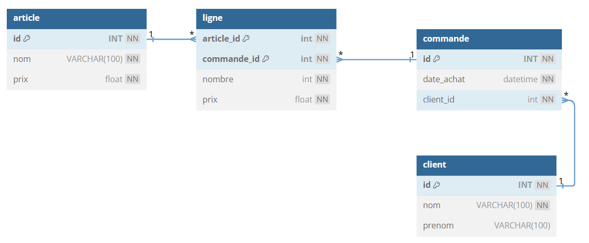

# TP 9 - SITE E-commerce
## :warning: La correction

  





:one: Créer la base de données   
:two: Créer les tables  
:three: Ajouter les données  

```sql
DROP DATABASE IF EXISTS e_commerce;
CREATE DATABASE e_commerce CHARACTER SET utf8mb4 COLLATE utf8mb4_unicode_ci;
USE e_commerce;

CREATE TABLE client (
  id INT NOT NULL AUTO_INCREMENT,
  nom VARCHAR(100) NOT NULL,
  prenom VARCHAR(100),
  CONSTRAINT pk_client PRIMARY KEY  pk_client(id)
)ENGINE=INNODB;

CREATE TABLE commande (
  id INT NOT NULL AUTO_INCREMENT,
  date_achat DATETIME NOT NULL,
  client_id int NOT NULL,
  CONSTRAINT pk_commande PRIMARY KEY  pk_commande(id)
)ENGINE=INNODB;

CREATE TABLE article (
  id INT NOT NULL AUTO_INCREMENT,
  nom VARCHAR(100) NOT NULL,
  prix float NOT NULL,
   CONSTRAINT pk_article PRIMARY KEY  pk_article(id)
)ENGINE=INNODB;

CREATE TABLE ligne (
  article_id int NOT NULL,
  commande_id int NOT NULL,
  nombre int NOT NULL,
  prix float NOT NULL,
  CONSTRAINT pk_ligne PRIMARY KEY (article_id, commande_id)
)ENGINE=INNODB;

ALTER TABLE commande ADD CONSTRAINT fk_client FOREIGN KEY (client_id) REFERENCES client(id);
ALTER TABLE ligne ADD CONSTRAINT fk_article FOREIGN KEY (article_id) REFERENCES article(id);
ALTER TABLE ligne ADD CONSTRAINT fk_commande FOREIGN KEY (commande_id) REFERENCES commande(id);

########################
# Les Données
########################

-- article
INSERT INTO article (nom,prix) VALUES
('PlayStation 5',	500),
('X box',	350),
('Machine à café',	400),
('PlayStation 3',	100);
-- client
INSERT INTO client (prenom,nom) VALUES
('Brad','PITT'),	
('George','CLONEY'),
('Jean','DUJARDIN');
-- commande
INSERT INTO commande (date_achat,client_id) VALUES('2024/09/08 10:15:00',1);
-- ligne
INSERT INTO ligne (article_id,commande_id,nombre,prix) VALUES
(4,1,2,100),
(3,1,1,300),
(2,1,1,350);
```


:four: Afficher la commande de Brad
|prenom|nom|date_achat|nom|prix|nb|total|
|---|---|---|---|---|---|---|
|PITT|Brad|2024-09-08 10:15:00|X box|350|1|350|
|PITT|Brad|2024-09-08 10:15:00|Machine à café|300|1|300|
|PITT|Brad|2024-09-08 10:15:00|PlayStation 3|100|2|200|
```sql
USE e_commerce;
SELECT 
client.prenom AS prenom,
client.nom AS nom,
commande.date_achat as date_achat,
article.nom AS nom,
ligne.prix AS prix,
ligne.nombre AS nb,
ligne.prix*ligne.nombre AS total
FROM
commande
INNER JOIN ligne ON commande.id = ligne.commande_id
INNER JOIN article ON article_id= article.id
INNER JOIN client ON client.id = commande.client_id
WHERE commande_id=1;
```
|total_ht|total_tva|total_ttc|
|---|---|---|
|850|170|1020|

```sql
USE e_commerce;
-- le TOTAL
SELECT 
 SUM(ligne.prix*ligne.nombre) AS total_ht,
 SUM(ligne.prix*ligne.nombre*0.2) AS total_tva,
 SUM(ligne.prix*ligne.nombre*1.2) AS total_ttc
FROM
commande
INNER JOIN ligne ON commande.id = ligne.commande_id
WHERE commande_id=1;
```

# Bonus : pseudo code pour db diagram
  

[db Diagram](https://dbdiagram.io/home) 
**prompt db diagram :**

```
Table client {
  id INT [pk, not null, increment]
  nom VARCHAR(100) [not null]
  prenom VARCHAR(100)
}
Table commande {
  id INT [pk, not null, increment]
  date_achat datetime [not null]
  client_id int [not null] 
}
Table article {
  id INT [pk, not null, increment]
  nom VARCHAR(100) [not null]
  prix float [not null]
}
Table ligne {
  article_id int  [not null,pk]
  commande_id int  [not null,pk]
  nombre int [not null]
  prix float [not null]
}
Ref: "article"."id" < "ligne"."article_id"
Ref: "commande"."id" < "ligne"."commande_id"
Ref: "client"."id" < "commande"."client_id"
```