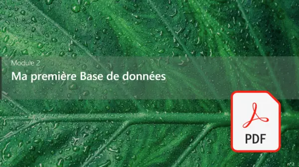

# Plan de la formation - Les fondamentaux SQL
  
    

## JOUR 1 MATIN
  
 
<a href="./00 Les fichiers PDF - Supports de cours/02 Ma première Base de données.pdf">
Le PDF : Module 02 Ma première Base de données
</a>  
 
  
### Création de la base données (data base)
- Créer une base de données  
- Effacer une base de données  
### Création d'une table
- Créer une table  
- Effacer une table  
- Ajouter des champs avec un type  
- Créer une contrainte de clef primare  
- Créer une contrainte de nullité  
- Mettre des valeurs par défault  

$\color{blue}{\text{TP 01 Le monde des chats}}$  
Création d'une table chat 
  
$\color{blue}{\text{TP 02 VIP Cocktail}}$  $\color{red}{\text{[BONUS]}}$   
Création d'une table personne
  

## JOUR 1 APRES MIDI

<table>
<tr>
<td width="50%">
  
 
<a href="./00 Les fichiers PDF - Supports de cours/03 Insertion et modification des données.pdf">
Le PDF : Module 03 Insertion et modification des données
</a>  
</td>
<td width="50%">
  
 
<a href="./00 Les fichiers PDF - Supports de cours/04 Extraire les données.pdf">
Le PDF : Module 04 Extraire les données
</a>  
</td>

</tr>
</table>

### Ajouter des données dans une table
- Ajouter des données avec ou sans clef primaire  
- Tester les valeurs par défaults  
- Tester les valeurs null  

### Lecture des données des données dans une table
- Prendre en main **AS**
- Utiliser la condition **WHERE**
- Filtrer avec **LIMIT**
- Classer avec **ORDER BY**

$\color{blue}{\text{TP 03 Le monde des chats partie 2}}$  
Ajouter les données avec <code>INSERT</code>  
Afficher les données avec <code>SELECT</code>  
  
$\color{blue}{\text{TP 04 VIP Cocktail partie 2}}$  $\color{red}{\text{[BONUS]}}$   
Ajouter les données avec <code>INSERT</code>  
Afficher les données avec <code>SELECT</code>  

## JOUR 2 MATIN
<table>
<tr>
<td width="50%">
  
 
<a href="./00 Les fichiers PDF - Supports de cours/05 La contrainte de clef étrangère.pdf">
Le PDF : Module 05 La contrainte de clef étrangère
</a>
</td>
<td width="50%">
  
 
<a href="./00 Les fichiers PDF - Supports de cours/06 Les jointures.pdf">
Le PDF : Module 06 Les jointures
</a>
</td>
</tr>
</table>

### La clef étrangère
- Créer une clef étrangère  
- Remplir une table avec une clef étrangère  
- Présentation de db diagram    

### Les Jointures :
Mettre en place des jointures pour extraires les données :
- INNER JOIN  
- LEFT JOIN  
- RIGHT JOIN  

$\color{blue}{\text{TP 05 Le monde des chats partie 3}}$  
Mise en place de <code>INNER JOIN</code>  
  
$\color{blue}{\text{TP 06 Films avec catégories}}$  $\color{red}{\text{[BONUS]}}$   
Mise en place de <code>INNER JOIN</code>  

## Jour 2 APRES MIDI
  
 
<a href="./00 Les fichiers PDF - Supports de cours/07 Mise en place de plusieurs jointures.pdf">
Le PDF : Module 07 Mise en place de plusieurs jointures
</a>  
 
  
### Les Jointures :
Comment relier plusieurs table avec <code>INNER JOIN</code> et <code>LEFT JOIN</code> ?

$\color{blue}{\text{TP 07 Le CRM : Devis et Factures}}$  
Mise en place de plusieurs <code>INNER JOIN</code> et <code>LEFT JOIN</code>   
Extraire les données avec plusieurs jointures  
  

## Jour 3 MATIN
  
 
<a href="./00 Les fichiers PDF - Supports de cours/08 La table de jointures.pdf">
Le PDF : Module 08 La table de jointure
</a>

### Les Tables de jointures :
- Créations d'une table de jointures
- Mettre enplace une clef primaire sur 2 ID
- Extraire les données  

$\color{blue}{\text{TP 08 Les films et Acteurs}}$  
Extraire les données  

## Jour 3 APRES MIDI
$\color{blue}{\text{TP 09 Site E-commerce}}$  $\color{red}{\text{[BONUS]}}$   
Extraire les données  

$\color{blue}{\text{TP 10 Location ski}}$  $\color{red}{\text{[SUPER BONUS]}}$   __difficulté : bucheron canadien__ :cactus::cactus::cactus::cactus:  
Extraire les données 

